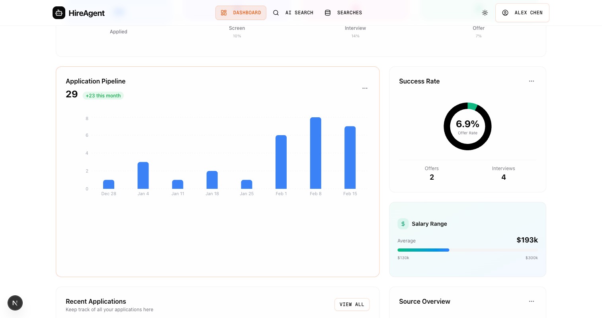

# Job Tracker

A full-stack workspace for discovering jobs, saving opportunities and tracking applications, notes and follow-ups. Next.js handles the application interface and records; a Python FastAPI/CrewAI service supports job search.

**Status:** product prototype. Application tracking is implemented in the local database. The `bulk-apply` route records status/activity changes; it does not establish submission to an employer or an ATS receipt.



This is a previously committed interface capture showing the earlier HireAgent UI label, not live hiring outcomes or a newly verified deployment.

## Local setup

Use Node.js and pnpm compatible with `package.json`, Python for the agent service, and Docker for the development PostgreSQL database.

```bash
git clone https://github.com/anudeepadi/job-tracker.git
cd job-tracker
npm run setup
npm run db:start
```

Review the generated `.env` against [.env.example](.env.example) and configure your local database/authentication values. Provider-backed search requires your own API configuration and may incur provider charges. The setup scripts create a Python environment and install frontend/backend dependencies.

Apply migrations and start development services:

```bash
cd apps/web
pnpm prisma migrate deploy
cd ../..
npm run dev
```

The development frontend uses `http://localhost:3000`; the Python agent service uses `http://localhost:8000` and exposes `/docs`. See [Docker setup](DOCKER_QUICK_START.md) and [testing notes](TESTING.md) for alternate workflows. This refresh checks the documented entry points against source; it does not certify a fresh full-stack installation.

## Discovery → tracked application

1. Search through a configured job source, or add an opportunity manually.
2. Review the employer, title, location and source URL, then import the selected result.
3. Add notes, a follow-up and the actual application status.
4. Submit through the employer's application path and record its receipt before treating it as applied.

The source contains search-result import routes, application CRUD, activity/reminder routes and CSV export. Automated discovery and status bookkeeping should not be confused with a successful external application.

## Useful commands

| Command | Purpose |
|---|---|
| `npm run dev:web` | Frontend only |
| `npm run dev:agent` | Python agent API only |
| `npm run build:web` | Frontend build |
| `npm run db:logs` | Local database logs |
| `pnpm test` | Configured workspace tests |

## Implementation

- [Web application](apps/web/)
- [Application API](apps/web/src/app/api/applications/)
- [Search service](services/job-agent/)
- [Deployment guidance](docs/DEPLOYMENT_GUIDE.md)

Authentication, email alerts and external data sources need their corresponding configuration. No hosted demo is advertised until the complete workflow is verified.

## License and credits

The original README identifies MIT licensing; no standalone LICENSE file is included in this checkout. The project builds on Next.js, CrewAI and shadcn/ui, with Railway deployment configuration.
