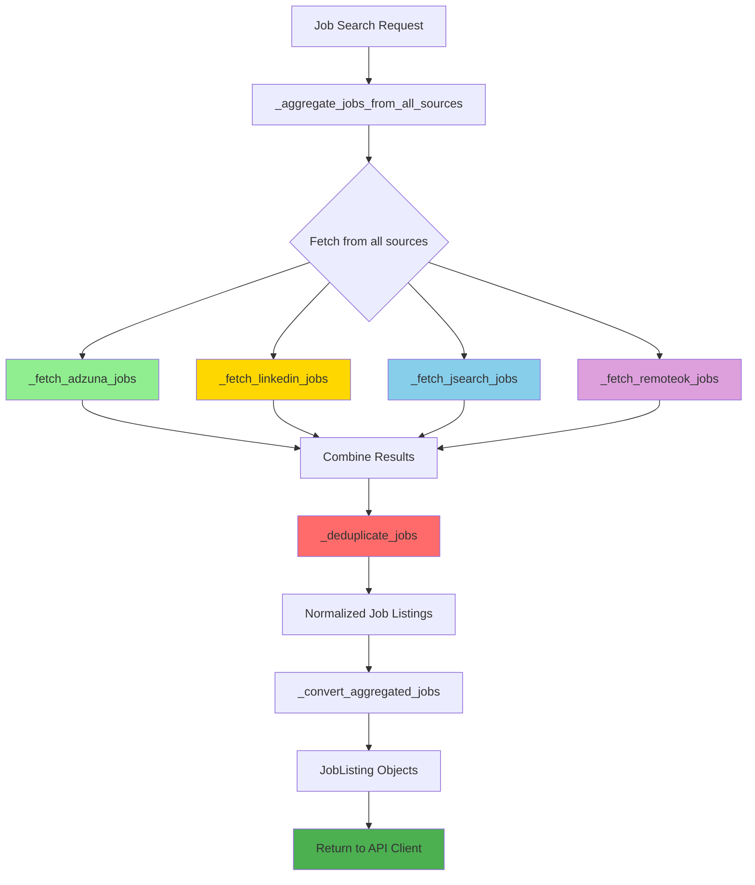

# Multi-Source Job Search Implementation

## Overview

Successfully enhanced the job search system to fetch jobs from **4 different sources** instead of just Adzuna. The system now aggregates, deduplicates, and provides comprehensive job listings from multiple platforms.

## Implementation Summary

### ✅ Completed Tasks

#### 1. **Added JSearch API Tool** (RapidAPI - Multi-Board Aggregator)
- **File**: `services/job-agent/src/tools.py`
- **Function**: `search_jsearch_jobs(role, location, num_results)`
- **Features**:
  - Aggregates jobs from Indeed, LinkedIn, Glassdoor, ZipRecruiter, BeBee, and more
  - Normalizes job data to consistent format
  - Handles remote job filtering
  - Graceful error handling with informative messages
  - Rate limiting with configurable delay
  - Returns formatted XML-style job listings

#### 2. **Added RemoteOK API Tool** (Free, No Auth Required)
- **File**: `services/job-agent/src/tools.py`
- **Function**: `search_remoteok_jobs(role, location, num_results)`
- **Features**:
  - Specializes in remote-first tech positions
  - No API key required (completely free)
  - Client-side filtering by role keywords
  - Searches position, description, and tags
  - Can be enabled/disabled via config
  - Formats jobs with skills/tags from API

#### 3. **Enhanced Configuration**
- **File**: `services/job-agent/src/config.py`
- **New Config Variables**:
  ```python
  JSEARCH_RAPIDAPI_KEY        # JSearch API key
  JSEARCH_BASE_URL            # JSearch API endpoint
  JSEARCH_RAPIDAPI_HOST       # RapidAPI host
  REMOTEOK_ENABLED            # Enable/disable RemoteOK
  REMOTEOK_BASE_URL           # RemoteOK API endpoint
  API_RATE_LIMIT_DELAY        # Delay between API calls
  ```
- **Updated `print_config()`**: Now shows status of all job sources

#### 4. **Integrated LinkedIn Tool into Crew Service**
- **File**: `services/job-agent/app/services/crew_service.py`
- **New Method**: `_fetch_linkedin_jobs()`
- LinkedIn was already implemented in tools but not wired into the crew service
- Now properly integrated with error handling and normalization

#### 5. **Multi-Source Aggregation System**
- **File**: `services/job-agent/app/services/crew_service.py`
- **New Methods**:
  - `_fetch_adzuna_jobs()` - Enhanced with better logging
  - `_fetch_linkedin_jobs()` - Newly integrated
  - `_fetch_jsearch_jobs()` - New implementation
  - `_fetch_remoteok_jobs()` - New implementation
  - `_deduplicate_jobs()` - Removes duplicates by URL and title+company
  - `_aggregate_jobs_from_all_sources()` - Orchestrates all sources

#### 6. **Graceful Degradation**
Each source:
- Checks if API credentials are configured
- Handles errors independently without crashing entire search
- Logs success/failure status
- Returns empty list on failure (allows other sources to continue)
- Provides informative error messages

#### 7. **Deduplication Logic**
- **Method**: `_deduplicate_jobs()`
- **Strategy**:
  - Primary: Deduplicate by job URL
  - Secondary: Deduplicate by title + company combination
  - Preserves first occurrence (source order matters)
  - Case-insensitive matching

#### 8. **Updated Agent Tools**
- **File**: `services/job-agent/src/agents.py`
- Job Searcher agent now has access to all 4 tools:
  - `search_jobs` (Adzuna)
  - `search_linkedin_jobs` (LinkedIn)
  - `search_jsearch_jobs` (JSearch)
  - `search_remoteok_jobs` (RemoteOK)

#### 9. **Updated Task Instructions**
- **File**: `services/job-agent/src/tasks.py`
- Job search task now instructs agent to use ALL available tools
- Mentions that some tools may not be available if API keys not configured

#### 10. **Updated Environment Configuration**
- **File**: `.env.example`
- Added comprehensive documentation for all job search APIs:
  - Adzuna (required)
  - LinkedIn (optional, paid)
  - JSearch (optional, free tier + paid)
  - RemoteOK (optional, completely free)
- Included links to API signup pages
- Clear indicators for required vs optional services

#### 11. **Updated Documentation**
- **File**: `services/job-agent/README.md`
- Added "Job Source Details" section
- Documented all 4 sources with pricing info
- Explained automatic aggregation and deduplication
- Listed graceful degradation features

#### 12. **Enhanced Logging & Monitoring**
The system now provides detailed logging:
```
🔍 Fetching jobs from Adzuna: role='Software Engineer', location='Remote'
✅ Adzuna returned 5 results
🔍 Fetching jobs from LinkedIn: role='Software Engineer', location='Remote'
✅ LinkedIn returned 3 results
🔍 Fetching jobs from JSearch: role='Software Engineer', location='Remote'
✅ JSearch returned 7 results
🔍 Fetching jobs from RemoteOK: role='Software Engineer'
✅ RemoteOK returned 10 results

================================================================================
📊 JOB AGGREGATION SUMMARY
================================================================================
  Sources used: Adzuna, LinkedIn, JSearch, RemoteOK
  Total jobs fetched: 25
  After deduplication: 18
================================================================================
```

## Architecture

### Data Flow



### Text Flow Diagram

```
Job Search Request
       ↓
_aggregate_jobs_from_all_sources()
       ↓
    ┌──────────────────────────────────────┐
    │  Parallel Fetching (with delays)     │
    ├──────────────────────────────────────┤
    │  ├─ _fetch_adzuna_jobs()    (Green)  │
    │  ├─ _fetch_linkedin_jobs()  (Gold)   │
    │  ├─ _fetch_jsearch_jobs()   (Blue)   │
    │  └─ _fetch_remoteok_jobs()  (Purple) │
    └──────────────────────────────────────┘
       ↓
  Combine all results
       ↓
  _deduplicate_jobs()  (Red - removes duplicates)
       ↓
  Normalized job listings
       ↓
  _convert_aggregated_jobs()
       ↓
  JobListing objects
       ↓
  Return to API client  (Green - success)
```

### Normalized Job Structure

All sources are normalized to this structure:
```python
{
    'title': str,
    'company': {'display_name': str},
    'location': {'display_name': str},
    'description': str,
    'redirect_url': str,
    'created': str,
    'source': str,  # Added for tracking
    'salary_min': Optional[float],
    'salary_max': Optional[float]
}
```

## Configuration Matrix

| Source | Required Config | Free Tier | Features |
|--------|----------------|-----------|----------|
| **Adzuna** | `ADZUNA_APP_ID`, `ADZUNA_API_KEY` | ✅ 1000 calls/month | General job board, salary data |
| **LinkedIn** | `LINKEDIN_RAPIDAPI_KEY` | ❌ Paid only | Professional network, quality listings |
| **JSearch** | `JSEARCH_RAPIDAPI_KEY` | ✅ 100 calls/month | Multi-board aggregator (Indeed, Glassdoor, etc.) |
| **RemoteOK** | `REMOTEOK_ENABLED=true` | ✅ Unlimited | Remote-first tech jobs, no auth needed |

## API Rate Limiting

To respect API rate limits:
- **Delay between calls**: 1 second (configurable via `API_RATE_LIMIT_DELAY`)
- **Timeout per request**: 30 seconds (configurable via `API_TIMEOUT`)
- **Max retries**: 3 attempts for Adzuna (with exponential backoff)
- **Graceful failures**: Individual source failures don't crash entire search

## Error Handling

Each tool handles these scenarios:
1. **Missing API credentials**: Returns warning message, skips gracefully
2. **HTTP 401 (Unauthorized)**: Invalid API key message
3. **HTTP 429 (Rate Limited)**: Rate limit exceeded message
4. **HTTP 403 (Forbidden)**: Subscription issue message
5. **Timeout**: Request timeout with retry suggestion
6. **Connection error**: Network failure message
7. **Invalid JSON**: JSON parsing error

## Testing Recommendations

### Test Case 1: All Sources Enabled
```bash
# Configure all API keys in .env
curl -X POST http://localhost:8000/api/search \
  -H "Content-Type: application/json" \
  -d '{"role": "Software Engineer", "location": "Remote", "num_results": 5}'
```
Expected: Jobs from 4 sources, deduplicated

### Test Case 2: Only Required Sources (Adzuna)
```bash
# Remove optional API keys from .env
curl -X POST http://localhost:8000/api/search \
  -H "Content-Type: application/json" \
  -d '{"role": "Data Scientist", "location": "San Francisco", "num_results": 10}'
```
Expected: Jobs from Adzuna only, system continues gracefully

### Test Case 3: With RemoteOK Only
```bash
# Keep only Adzuna (required) and RemoteOK (free)
# Set REMOTEOK_ENABLED=true
curl -X POST http://localhost:8000/api/search \
  -H "Content-Type: application/json" \
  -d '{"role": "DevOps Engineer", "location": "Remote", "num_results": 8}'
```
Expected: Mix of Adzuna and RemoteOK jobs

### Test Case 4: Invalid API Key
```bash
# Set JSEARCH_RAPIDAPI_KEY=invalid_key
curl -X POST http://localhost:8000/api/search \
  -H "Content-Type: application/json" \
  -d '{"role": "Product Manager", "location": "New York", "num_results": 5}'
```
Expected: JSearch fails gracefully, other sources succeed

## Files Modified

1. ✅ `services/job-agent/src/config.py` - Added new API configurations
2. ✅ `services/job-agent/src/tools.py` - Added JSearch and RemoteOK tools
3. ✅ `services/job-agent/src/agents.py` - Added all tools to job searcher
4. ✅ `services/job-agent/src/tasks.py` - Updated task instructions
5. ✅ `services/job-agent/app/services/crew_service.py` - Added aggregation logic
6. ✅ `.env.example` - Documented all API keys with links
7. ✅ `services/job-agent/README.md` - Added multi-source documentation

## Benefits

### For Users
- **More comprehensive results**: 4 sources instead of 1
- **Better remote job coverage**: RemoteOK specializes in remote-first
- **No single point of failure**: System continues if one source fails
- **Free options available**: RemoteOK is completely free
- **Deduplicated results**: No duplicate listings

### For Developers
- **Modular design**: Easy to add more sources
- **Graceful degradation**: Individual failures don't crash system
- **Clear logging**: Easy to debug which sources succeeded/failed
- **Normalized data**: Consistent format across all sources
- **Configurable**: Enable/disable sources via environment variables

### For System
- **Resilient**: Continues operation even if some APIs are down
- **Observable**: Detailed logging of aggregation process
- **Scalable**: Easy to add more job sources in the future
- **Maintainable**: Clear separation of concerns per source

## Future Enhancements (Not Implemented)

These could be added later:
1. **Caching**: Cache results per source to reduce API calls
2. **Intelligent routing**: Route to best source based on role/location
3. **Source prioritization**: Configure preferred sources per user
4. **Advanced deduplication**: Use ML similarity for better duplicate detection
5. **Source analytics**: Track which sources provide best results
6. **Retry logic**: Smart retry for transient failures
7. **Parallel fetching**: Use asyncio for true parallel requests
8. **Result ranking**: Score and rank results across sources

## Conclusion

The job search system is now significantly more robust with:
- **4 job sources** (Adzuna, LinkedIn, JSearch, RemoteOK)
- **Automatic aggregation and deduplication**
- **Graceful error handling**
- **Clear configuration and documentation**
- **Comprehensive logging**

All code compiles successfully and is ready for testing.
